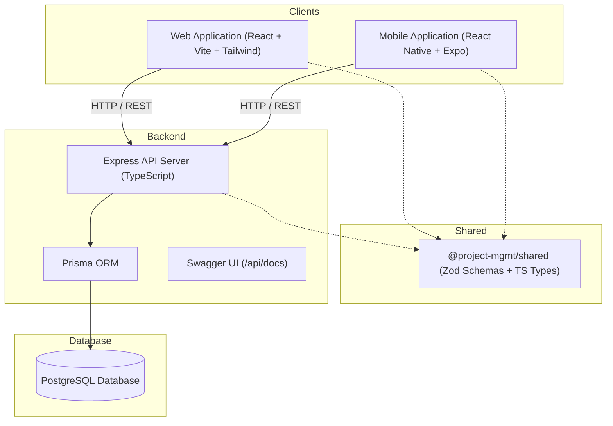

# Full Stack Project Management System (Web + Mobile + API)

A production-grade, monorepo Project Management System featuring a unified REST API serving a modern responsive web client and an Android-first Expo mobile application.

## 🚀 Live Deployments

- 🌐 **Web Application (Vercel)**: [https://project-management-system-olive-theta.vercel.app](https://project-management-system-olive-theta.vercel.app)
- 📱 **Android Mobile App (Direct APK Download)**: [Download TaskMatrix.apk (GitHub Release v1.0.0)](https://github.com/Nagendrasriram/Project-Management-System/releases/download/v1.0.0/TaskMatrix.apk) | [EAS Mirror](https://expo.dev/artifacts/eas/8_FJtXPQkMgLglgD7k-8tFnL3lkAtA28e7bDNBxEyxU.apk)
- ⚙️ **Backend REST API (Render)**: [https://project-management-api-c38i.onrender.com](https://project-management-api-c38i.onrender.com)
- 📖 **Interactive Swagger Documentation**: [https://project-management-api-c38i.onrender.com/api/docs](https://project-management-api-c38i.onrender.com/api/docs)
- 🩺 **Health Check**: [https://project-management-api-c38i.onrender.com/health](https://project-management-api-c38i.onrender.com/health)
- 🗄️ **Database**: Supabase Cloud PostgreSQL
- 📦 **GitHub Repository**: [https://github.com/Nagendrasriram/Project-Management-System](https://github.com/Nagendrasriram/Project-Management-System)

---

## 📱 Download & Try Android App (TaskMatrix)

The standalone Android app is built, verified, and connected to the live cloud backend. You can install and try it directly on your Android phone without any developer setup!

<p align="center">
  
  <br />
  <sub><b>Scan with your phone camera to download APK</b></sub>
</p>

### 📥 Download Links
| Source | Link | Notes |
| :--- | :--- | :--- |
| **GitHub Releases (Recommended)** | [Download TaskMatrix.apk (v1.0.0)](https://github.com/Nagendrasriram/Project-Management-System/releases/download/v1.0.0/TaskMatrix.apk) | Official release asset hosted on GitHub |
| **Expo EAS Cloud CDN** | [Download TaskMatrix.apk (EAS Mirror)](https://expo.dev/artifacts/eas/8_FJtXPQkMgLglgD7k-8tFnL3lkAtA28e7bDNBxEyxU.apk) | Direct build artifact from EAS Build |
| **All Releases** | [GitHub Releases Page](https://github.com/Nagendrasriram/Project-Management-System/releases) | Release notes, changelog & assets |

### 📲 Installation Instructions (Android)
1. **Download**: Tap either download link above on your Android phone (or scan the QR code).
2. **Install**: Tap the downloaded `TaskMatrix.apk` notification or find it in your phone's *Downloads* folder. If Android displays *"For your security, your phone is not allowed to install unknown apps from this source"*, tap **Settings** and enable **Allow from this source**.
3. **Launch**: Tap **Install** and then **Open**.

### 🔑 Try It Out (Instant Demo Credentials)
The app comes with demo buttons on the login screen for 1-tap testing:

- **Option 1 (One-Tap Autofill)**: On the login screen, tap the **Alice (2 Projects)** button, then tap **Sign In**.
- **Option 2 (Manual Login)**:
  - **Email**: `alice@example.com`
  - **Password**: `Password123!`
  - *(Or test Bob: `bob@example.com` / `Password123!` to test multi-tenant isolation)*
- **Option 3 (Sign Up)**: Tap **Sign up**, enter your name, email, and password (min 8 chars) to create a brand-new account.

### 🌟 Features to Test on Mobile
- 📊 **Real-time Dashboard**: Overview of total projects, tasks, completion rates, and status metrics.
- 📁 **Project Management**: Create, view, edit, and delete projects.
- ✅ **Task Management**: Create tasks with priorities (`LOW`, `MEDIUM`, `HIGH`, `URGENT`), statuses (`TODO`, `IN_PROGRESS`, `DONE`), and due dates.
- 🔍 **Filtering & Search**: Filter tasks by status and priority on the fly.
- 🔄 **Real-Time Cross-Client Sync**: Create a task on your phone and refresh the [Web Application](https://project-management-system-olive-theta.vercel.app) to see it updated live!
- 🔒 **Secure Keystore Authentication**: JWTs are safely encrypted in Android Keystore via `expo-secure-store`.

---

## 🏛️ Architecture Overview



### Monorepo Structure
- `/backend`: Node.js + Express + TypeScript + Prisma ORM + PostgreSQL
- `/web`: React + Vite + TypeScript + Tailwind CSS + TanStack Query + React Hook Form + Zod
- `/mobile`: React Native (Expo SDK 51) + TypeScript + React Navigation + NetInfo + Expo SecureStore
- `/shared`: Cross-platform shared Zod validation schemas, enums, and TypeScript interfaces
- `/docs`: OpenAPI docs, ER diagram, demo recording script
- `docker-compose.yml`: Multi-container Docker configuration (PostgreSQL + Backend + Web)

---

## ⚙️ Prerequisites

- **Node.js**: `v20.x` or `v22.x` (or later)
- **npm**: `v10.x` or later
- **PostgreSQL**: `v15` or later (or Docker Desktop)
- **Expo Go App** (optional, for physical Android / iOS testing) or Android Studio emulator

---

## 🚀 Quickstart (Local Development)

### 1. Install Dependencies
```bash
npm install
```

### 2. Build Shared Package
```bash
npm run build:shared
```

### 3. Setup Database (PostgreSQL)
Ensure PostgreSQL is running locally, then initialize and seed test data:
```bash
npm run db:migrate
npm run db:seed
```

### 4. Run Backend Server
```bash
npm run dev:backend
```
- API Base URL: `http://localhost:5000/api`
- Swagger Documentation: `http://localhost:5000/api/docs`
- Health check: `http://localhost:5000/health`

### 5. Run Web Client
In a new terminal window:
```bash
npm run dev:web
```
- Web Application: `http://localhost:5173`

### 6. Run Mobile App
In a new terminal window:
```bash
npm run dev:mobile
```
- Scan QR code with the Expo Go app on Android, or press `a` for Android emulator.

---

## 🐳 Docker Setup (One-Command Launch)

To start PostgreSQL, backend, and web simultaneously in Docker containers:
```bash
docker-compose up --build
```
- Web Frontend: `http://localhost:3000`
- Backend API: `http://localhost:5000/api`
- Swagger UI: `http://localhost:5000/api/docs`
- PostgreSQL: `localhost:5432`

---

## 🔑 Seed Test Accounts

The database comes pre-seeded with 2 isolated test users (`Password123!` for both):

| User Name | Email | Initial Projects | Purpose |
| :--- | :--- | :--- | :--- |
| **Alice Smith** | `alice@example.com` | Mobile App Redesign, Cloud Migration | Primary tester (has projects & tasks) |
| **Bob Johnson** | `bob@example.com` | Q4 Marketing Campaign | Verifies authorization isolation |

---

## 🧪 Running Automated Tests

Run the backend unit tests (Zod validation schemas) and integration tests (Supertest for auth, rate limiting, and 2-user tenant isolation):
```bash
npm run test:backend
```

All 27 automated tests cover:
- Authentication & bcrypt cost 12 hashing
- Session revocation via `tokenVersion`
- Resource isolation between User 1 and User 2 (Bob receives `404` when attempting to access Alice's resources)
- Start date / End date validation
- Aggregate query calculations for dashboard

---

## 📱 Mobile App Setup & Connection Guide

### Connecting Mobile to Backend
Configure `mobile/.env`:

1. **Android Emulator**:
   ```env
   EXPO_PUBLIC_API_URL="http://10.0.2.2:5000/api"
   ```
2. **Physical Device on Local Wi-Fi (LAN)**:
   Find your machine's local IP address (e.g. `192.168.1.150` via `ipconfig` or `ifconfig`) and set:
   ```env
   EXPO_PUBLIC_API_URL="http://192.168.1.150:5000/api"
   ```
3. **Deployed Production API**:
   ```env
   EXPO_PUBLIC_API_URL="https://your-api.onrender.com/api"
   ```

### Building Android APK via EAS Build
The repository is preconfigured with `mobile/eas.json` for Android APK generation:
```bash
cd mobile
npx eas-cli login
npx eas-cli build -p android --profile preview
```
This produces a downloadable standalone `.apk` without requiring Google Play Store submission.

---

## 🌐 Production Deployment Guide

### 1. Database (Neon / Supabase)
1. Create a free managed PostgreSQL instance on [Neon](https://neon.tech) or [Supabase](https://supabase.com).
2. Copy the connection string (with `?sslmode=require`).

### 2. Backend (Render / Railway)
1. Deploy from your GitHub repository with root directory `./backend` or use the root `Dockerfile`.
2. Configure Environment Variables:
   - `DATABASE_URL`: Your Neon/Supabase connection string
   - `JWT_SECRET`: Random 32+ character key
   - `JWT_EXPIRES_IN`: `1h`
   - `WEB_ORIGIN`: Your deployed web URL (e.g. `https://your-app.vercel.app`)
   - `NODE_ENV`: `production`
   - `PORT`: `5000` (or leave default for Render)
3. Set Build Command: `npx prisma migrate deploy && npm run build`
4. Set Start Command: `npm start`

### 3. Web Frontend (Vercel / Netlify)
1. Import repository on [Vercel](https://vercel.com).
2. Set Root Directory to `web`.
3. Configure Environment Variable:
   - `VITE_API_URL`: Your deployed backend URL + `/api` (e.g. `https://your-api.onrender.com/api`)
4. Build command: `npm run build`
5. Output directory: `dist`

---

## 🔒 Security Best Practices Implemented

- **Password Hashing**: Passwords hashed with `bcryptjs` using salt rounds of 12. Password hashes are never returned in queries or responses.
- **Active Token Invalidation**: `tokenVersion` column on the User model is incremented on logout. Stale or stolen tokens are rejected with `401 TOKEN_REVOKED`.
- **Tenant Isolation**: Queries filter exclusively on `ownerId` or `project.ownerId`. Accessing another user's project/task returns `404 Not Found` (preventing resource existence enumeration).
- **Secure Mobile Storage**: JWT tokens on mobile are stored only in `expo-secure-store` (Android Keystore / iOS Keychain), never plain `AsyncStorage`.
- **Rate Limiting**: `express-rate-limit` enforces a maximum of 5 attempts per 15 minutes per IP on `/api/auth/login` and `/api/auth/register`.
- **HTTP Hardening**: `helmet` headers, strict CORS validation, and JSON body parsing size limit (100kb).
- **Safe Logging**: `pino` logger redacts `authorization`, `password`, and `token` fields automatically.
