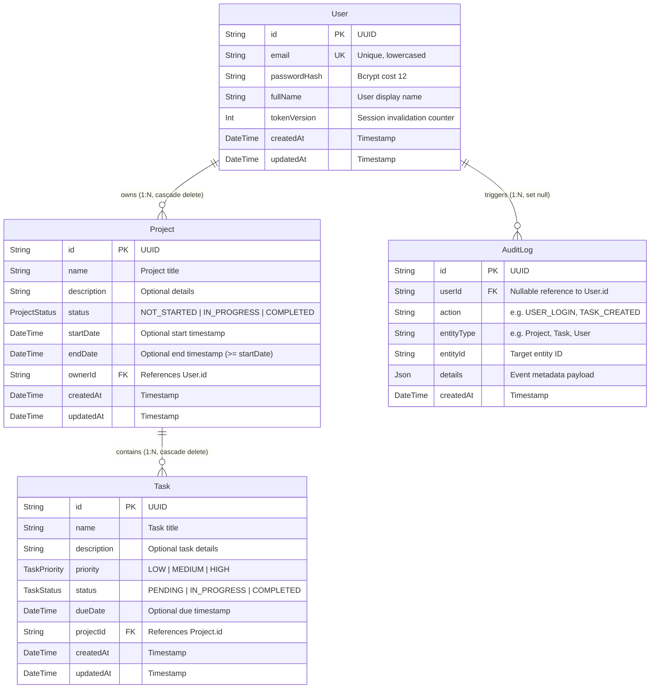

# Database Schema & Entity-Relationship (ER) Diagram

The Project Management System uses a normalized relational PostgreSQL database managed via Prisma ORM.

## Entity-Relationship Diagram

## Relational Constraints & Indexes

1. **Foreign Keys & Cascades**:
   - `projects.ownerId -> users.id` with `ON DELETE CASCADE`. If a user is deleted, all owned projects are safely removed.
   - `tasks.projectId -> projects.id` with `ON DELETE CASCADE`. If a project is deleted, all tasks within that project are deleted automatically.
   - `audit_logs.userId -> users.id` with `ON DELETE SET NULL`. Audit trails remain intact even if user records are purged.

2. **Indexes**:
   - `users(email)`: Unique B-tree index for $O(1)$ case-insensitive login lookups.
   - `projects(ownerId)`: B-tree index for filtering projects by authenticated owner.
   - `projects(status)`: B-tree index for status queries and aggregation.
   - `tasks(projectId)`: B-tree index for loading tasks in a project.
   - `tasks(status)`, `tasks(priority)`, `tasks(dueDate)`: Composite filtering optimization.
   - `audit_logs(userId)`, `audit_logs(createdAt)`: Fast temporal querying for audits.
